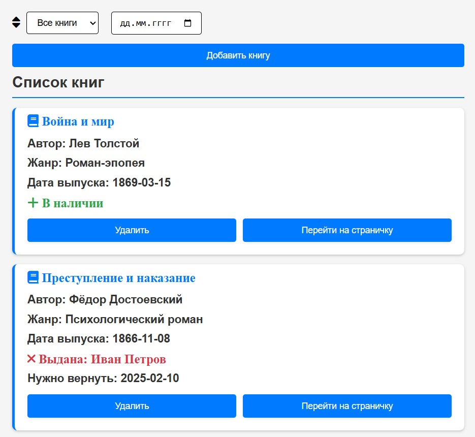
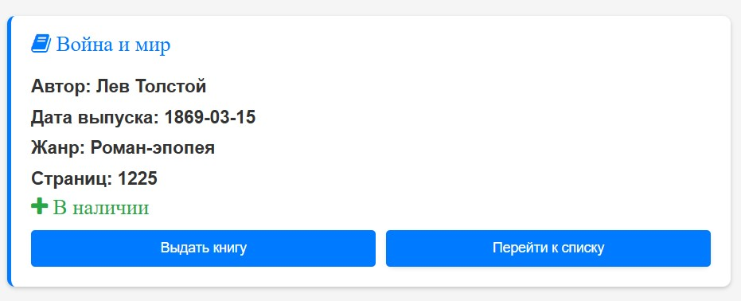
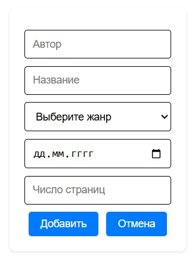

# Express Library Manager

Веб-приложение для управления библиотекой с использованием Node.js, Express и Pug.

## Технические требования

- Node.js
- JavaScript
- npm

## Установка и запуск

Клонирование репозитория и установка зависимостей:

```bash
git clone https://github.com/nhitar/express-library-manager.git
cd express-library-manager

npm install
```

Запуск сервера:

```bash
npm start
```

Приложение будет доступно по адресу: `http://localhost:3000`.

## Функционал

- **Просмотр списка книг**
- **Фильтрация** - поиск по статусу (в наличии/выданы) и дате возврата, реализовано через `AJAX` запросы, поэтому не требует перезагрузки страницы
- **Добавление книг**
- **Удаление книг** - с подтверждением
- **Выдача книг** - возможность выдать книги с указанием читателя

## API Эндпоинты

Архитектура RESTful:

- `GET /` - редирект на `/books`
- `GET /books` - главная страница со списком книг; `json` для `AJAX`
- `POST /books` - добавить новую книгу
- `GET /books/:id` - карточка книги
- `POST /books/:id` - выдать книгу
- `DELETE /books/:id` - удалить книгу

## Демонстрация сайта

- Список книг



- Карточка книги



- Добавление новой книги


